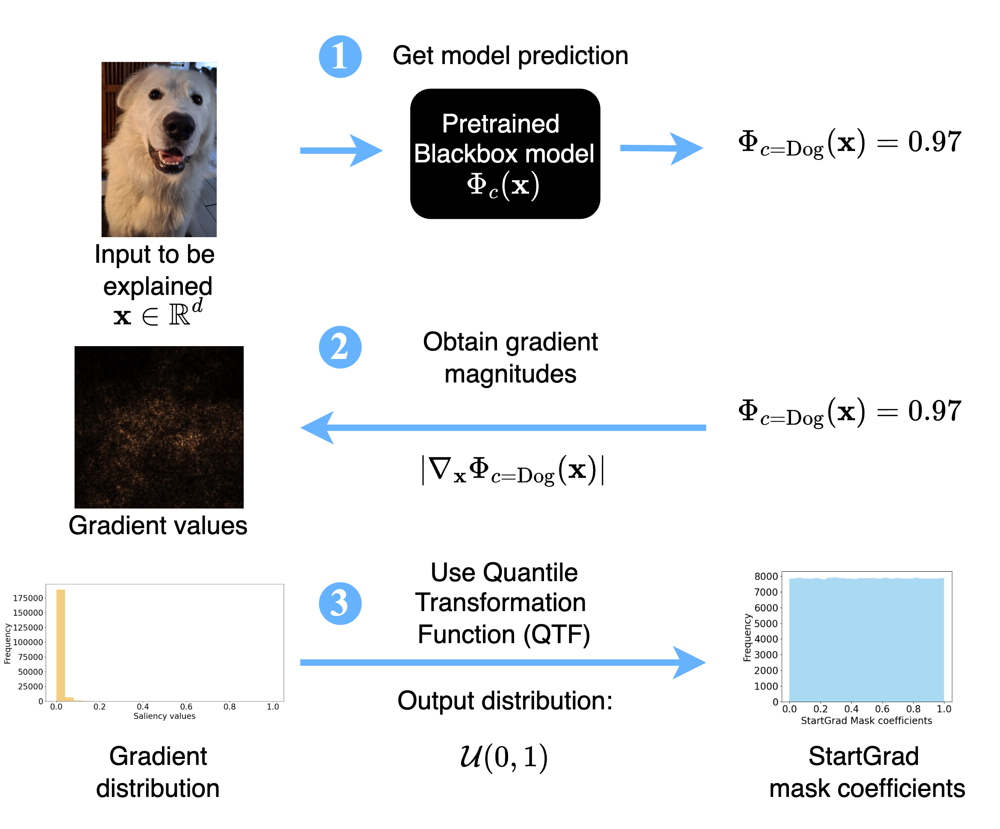

# Start Smart: Leveraging Gradients For Enhancing Mask-based XAI Methods

This repository contains the code for the paper: 
[Start Smart: Leveraging Gradients For Enhancing Mask-based XAI Methods](https://openreview.net/forum?id=Iht4NNVqk0&noteId=Iht4NNVqk0)

**Authors:** [Buelent Uendes](https://buelentuendes.github.io/), [Shujian Yu](https://sjyucnel.github.io/), and Mark Hoogendoorn

## Abstract
Mask-based explanation methods offer a powerful framework for interpreting deep learning model predictions across diverse data modalities, such as images and time series, in which the central idea is to identify an instance-dependent mask that minimizes the performance drop from the resulting masked input. Different objectives for learning such masks have been proposed, all of which, in our view, can be unified under an information-theoretic framework that balances performance degradation of the masked input with the complexity of the resulting masked representation. Typically, these methods initialize the masks either uniformly or as all-ones.
In this paper, we argue that an effective mask initialization strategy is as important as the development of novel learning objectives, particularly in light of the significant computational costs associated with existing mask-based explanation methods. To this end, we introduce a new gradient-based initialization technique called StartGrad, which is the first initialization method specifically designed for mask-based post-hoc explainability methods. Compared to commonly used strategies, StartGrad is provably superior at initialization in striking the aforementioned trade-off. Despite its simplicity, our experiments demonstrate that StartGrad consistently speeds up the optimization process of various state-of-the-art mask-explanation methods by reaching target metrics quicker and, in some cases, boosts their overall performance.

<p align="center">
  
</p>

## Setup and Usage

### Environment Setup & Installation of requirements
1. Please first create and activate a virtualenv via:
```bash
virtualenv <NAME_OF_YOUR_VIRTUALENV> 
source <NAME_OF_YOUR_VIRTUALENV>/bin/activate
```
2. Install the pytorch wavelets 
```bash
cd ./src
git clone https://github.com/fbcotter/pytorch_wavelets
cd pytorch_wavelets
pip install .
```
3. Now you can run and install the required packages via:
```bash
cd ../../
pip3 install -r requirements.txt
pip3 install -e .
```
4. Lastly, you need to install pyShearLab via:
```bash
pip3 install https://github.com/stefanloock/pyshearlab/archive/master.zip
```
### Repository structure
The repository is structured as follows. 

- `data/` contains the source code as well as the datasets used in this study
- `utils/` contains helper functions for the project.
- `src/` contains the main source code for the project for both vision and time-series experiments.
- `config_environment/` contains configuration files for experiments
- `experiments/` contains experiment scripts and notebooks
- `pics/` contains images used in documentation

### Weights and Biases
This project uses [W&B](https://wandb.ai) for experiment tracking and model management.

### Running Experiments
Experiment configurations are in the `config_environment` folder. The config files are configured to correpond to the default settings used in the paper. Please read the paper for more information on the hyperparameters.

#### Vision
Run ShearletX experiment:
```bash
python run_experiment.py experiment=mnist/dvp_vae
```

#### Time-Series
Run experiment with state dataset:
```bash
python run_experiment.py experiment=mnist/dvp_vae
```

## Citation
If you found this work useful in your research, please consider citing:
```bibtex
@article{buendes2025startgrad,
  title={Start Smart: Leveraging Gradients For Enhancing Mask-based XAI Methods},
  author={Uendes, Buelent  and Yu, Shujian, and Hoogendoorn, Mark},
  journal={Proceedings of the 13th International Conference on Learning Representations},
  year={2025}
}
```

## Acknowledgements
This work is funded by [Stress in Action]( www.stress-in-action.nl). The research project [Stress in Action]( www.stress-in-action.nl) is financially supported by the Dutch Research Council and the Dutch Ministry of Education, Culture and Science (NWO gravitation grant number 024.005.010).

Part of the code relies on repository [ShearletX](https://github.com/skmda37/ShearletX) for the associated paper [Explaining Image Classifiers with Multiscale Directional Image Representation](https://arxiv.org/pdf/2211.12857) for the vision experiments. For the time series experiments, we also relied on the repository [timeinterpret](https://github.com/josephenguehard/time_interpret) interpret inmplementation of the ExtremalMask model.
